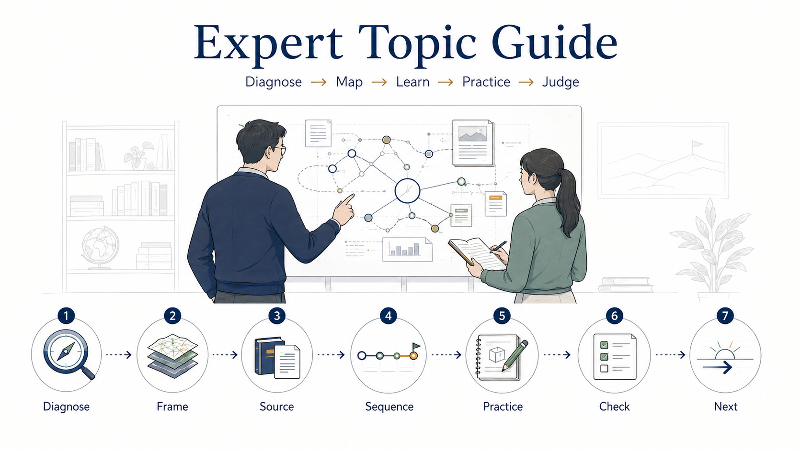
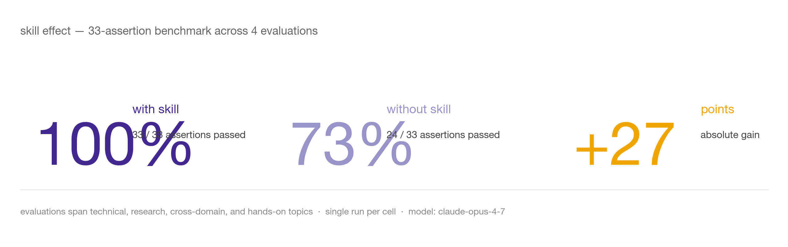
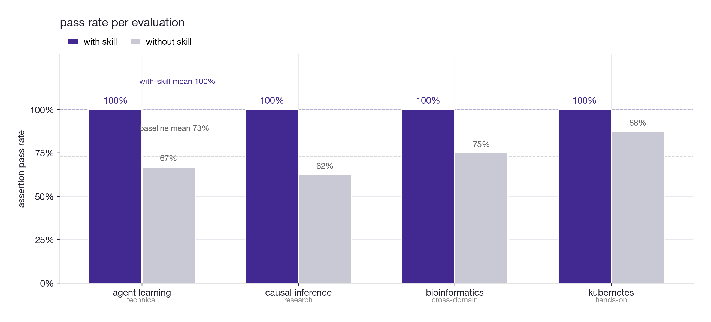
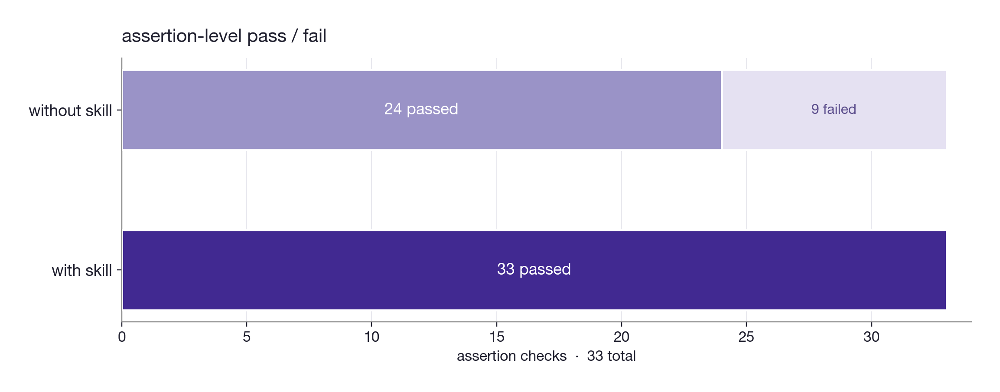
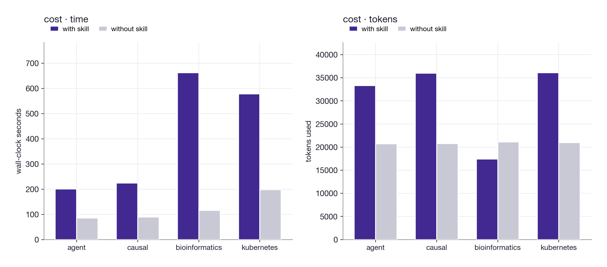
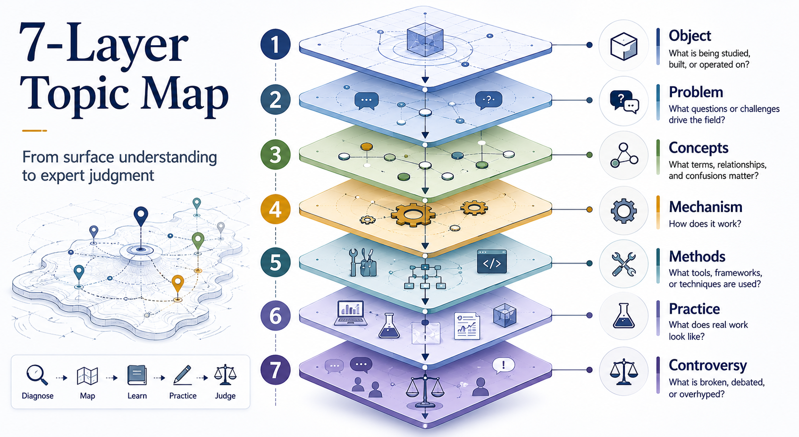

### A Claude/Codex Skill for entering unfamiliar topics like an expert mentor.

<p>
  <a href="https://github.com/Jefferson-Zhou/skill-expert-topic-guide"></a>
  
  
  
  
  
  
</p>

> When the user says "I know nothing about X" or "help me ramp up quickly", this skill makes the assistant behave like an expert mentor: diagnose first, map the field, sequence resources, assign practice, and test judgment.

`expert-topic-guide` is not a generic learning-plan generator. It is a sensemaking and learning-orchestration skill for unfamiliar domains. Its goal is to move the user from passive reading to working judgment: knowing what matters, what to read first, what to postpone, how to practice, and how to tell whether they actually understand.

## Benchmark at a Glance

<p align="center">
  
</p>

A 33-assertion benchmark across four topic types — technical (LLM agents), research (causal inference), cross-domain (bioinformatics), hands-on (Kubernetes). The skill passes every assertion in every evaluation; the unguided baseline passes 73% on average.

### Per-evaluation pass rate

<p align="center">
  
</p>

The skill is consistent across topic types. The baseline drops most on research topics (causal inference, 62%) where the structured 7-layer map and resource-by-role recommendations matter most, and is closest on Kubernetes (88%) where the model already has strong default patterns.

### Assertion-level view

<p align="center">
  
</p>

The 9 baseline failures cluster around three things: missing 7-layer topic maps, missing checkpoint questions, and resource lists without role/timing/effort annotations — the exact artifacts the skill enforces.

### Cost of structure

<p align="center">
  
</p>

Structured guidance is not free: with-skill runs use roughly 3.4x wall-clock time and 1.5x tokens. The extra spend buys reading reference modules, browsing for current resources, and producing the full 7-section output. For one-shot ramp-up tasks where the alternative is days of mis-sequenced reading, the trade is favorable; for casual questions, it is the wrong tool.

| Metric | with skill | without skill | delta |
|---|---|---|---|
| Mean pass rate | 100% (33/33) | 73% (24/33) | +27 pts |
| Range across evals | 100%–100% | 62%–88% | tighter |
| Mean wall-clock | 416 s | 122 s | +294 s |
| Mean tokens | 30,714 | 20,885 | +9,829 |

Reproduce: the four evaluations and raw run artifacts (with-skill / without-skill responses, per-assertion gradings, aggregated benchmark JSON, and the chart-generating script) are kept in a separate development workspace, not in this skill repo. The README ships the rendered charts so the skill repo stays minimal and installable.

## What It Does

| Stage | What the skill does | Output artifact |
|---|---|---|
| 1. Diagnose | Infers or asks about background, goal, time budget, and topic type | Assumptions or 1-2 calibration questions |
| 2. Frame | Builds a 7-layer map of the domain's deep structure | Object / Problem / Concepts / Mechanism / Methods / Practice / Controversy |
| 3. Source | Selects materials by role instead of dumping links | Must-read / should-read / optional resources with timing and caveats |
| 4. Sequence | Turns resources into a time-boxed path | 1-hour / 1-day / 1-week / 1-month roadmap |
| 5. Practice | Designs tasks that produce artifacts | Concept maps, analysis notes, demos, critique tables, research questions |
| 6. Check | Tests understanding beyond recall | 5-8 checkpoint questions |
| 7. Next | Ends with a concrete next move | One immediate action matched to the user's goal |

## Why This Skill Exists

Most "learn X" answers fail in predictable ways:

| Common failure | What this skill does instead |
|---|---|
| Gives a long list of papers, books, courses, and links | Gives a sequence, priority tier, role, timing, effort, and caveat |
| Starts with definitions instead of the user's goal | Starts from what the user needs to be able to do |
| Treats every domain as paper reading | Routes between textbook, docs, papers, projects, case studies, benchmarks, and community evidence |
| Explains concepts but does not build judgment | Adds practice tasks and pass criteria |
| Overloads beginners | Keeps each stage to one clear next action and 1-2 must-read resources |
| Makes strong claims without checking currency | Browses for fast-moving topics and marks verified vs inferred resources |

## The 7-Layer Topic Map
<p align="center">
  
</p>

The map is the skill's central artifact. It keeps the assistant from treating a field as a bag of terms and forces it to expose structure, mechanisms, evidence, and failure modes.

## Source Routing

| Topic type | Start with | Then use | Avoid starting with |
|---|---|---|---|
| Theoretical | Textbook chapters, worked examples | Surveys, canonical papers | Random blog posts |
| Technical | Official docs, official examples | Architecture docs, source code, maintainer notes | Academic papers |
| Engineering | Architecture overviews, projects | Postmortems, benchmarks, talks | Pure theory |
| Research | Survey papers, anchor papers | Method papers, benchmarks, critiques | Blog summaries |
| Industry/applied | Case studies, standards, practitioner guides | Reports, postmortems, community discussions | Isolated papers |
| Hybrid | Goal-dependent route | Combine docs, papers, projects, benchmarks | One-size-fits-all syllabi |

## Reference Modules

| Reference | Loaded when | Purpose |
|---|---|---|
| `learning-diagnosis.md` | Background, goal, or time budget is ambiguous | Calibrate learner type and realistic outcome |
| `topic-mapping.md` | Building a substantial concept map | Expand the 7-layer map and concept relationships |
| `source-types.md` | Recommending resources | Choose materials by authority, role, timing, effort, and caveat |
| `literature-planning-patterns.md` | User wants professional literature | Sequence surveys, textbooks, landmark papers, benchmarks, and frontier work |
| `expert-learning.md` | User asks to learn like an expert or comes from an adjacent field | Use expert-novice, cognitive apprenticeship, and transfer strategies |
| `practice-design.md` | Designing exercises or self-check tasks | Create artifact-producing practice with pass criteria |
| `research-domain-mode.md` | Academic/research topics | Add literature roles, citation navigation, research landscape, and entry points |
| `technical-domain-mode.md` | Frameworks, tools, systems, programming | Add demo-first decisions, project path, failure analysis, and ecosystem map |
| `output-templates.md` | A stable final answer shape is useful | Full guide, quick overview, expert transfer, and research-entry templates |

## Example Prompts

### 1. Fast technical ramp-up

```text
Use $expert-topic-guide. I am a backend engineer and know Docker, but I know almost nothing about Kubernetes. I have 7 days before an architecture review. Guide me into it.
```

### 2. Research-domain entry

```text
Use $expert-topic-guide. I want to enter causal inference from a product analytics background. I need to read papers and judge whether analyses are credible.
```

### 3. Adjacent-field transfer

```text
Use $expert-topic-guide. I know classical NLP and information retrieval. Help me understand LLM agents fast, but do not give me a generic beginner course.
```

Sample outputs are kept in the development workspace and not bundled with the skill repo, in order to keep the installable footprint minimal.

## Install

The repository at [github.com/Jefferson-Zhou/skill-expert-topic-guide](https://github.com/Jefferson-Zhou/skill-expert-topic-guide) ships a single self-contained skill folder. Pick the host you use.

### Claude Code (recommended)

Clone and copy directly into your skills directory:

```bash
git clone git@github.com:Jefferson-Zhou/skill-expert-topic-guide.git
mkdir -p ~/.claude/skills
cp -R skill-expert-topic-guide ~/.claude/skills/expert-topic-guide
```

Or, if you only have the prebuilt `.skill` archive:

```bash
mkdir -p ~/.claude/skills
unzip expert-topic-guide.skill -d ~/.claude/skills/
```

Restart Claude Code or open a new session. Verify the skill is registered:

```bash
ls ~/.claude/skills/expert-topic-guide/SKILL.md
```

The skill auto-triggers on phrases like *"I know nothing about X"*, *"help me ramp up on X"*, *"give me an expert learning path for X"*. To force-invoke it, prefix any prompt with `Use $expert-topic-guide`.

### Codex / OpenAI Agents

```bash
git clone git@github.com:Jefferson-Zhou/skill-expert-topic-guide.git
mkdir -p ~/.codex/skills
cp -R skill-expert-topic-guide ~/.codex/skills/expert-topic-guide
```

The Codex UI metadata lives in `agents/openai.yaml`. Restart Codex or start a new session so the skill list refreshes.

### Anthropic Agent SDK

Drop the folder into your project's skills directory and register it where your agent loads SKILL.md files. The skill is host-agnostic — it depends only on a model that can read referenced markdown files on demand.

### Update an existing install

```bash
cd ~/.claude/skills/expert-topic-guide
git pull
```

Or repeat the clone-and-copy step above with the latest version.

### Verify it works

After install, paste this into a new session:

```text
Use $expert-topic-guide. I'm a backend engineer who knows nothing about graph neural networks. Give me a one-week path.
```

A correct response opens with **Quick Assessment** and **Topic Map** (7 layers), not a bulleted list of papers. If you see a generic syllabus, the skill did not load — check that `SKILL.md` is at the top of the skill folder.

## Trigger Phrases

The skill is designed to trigger automatically when the user signals an "I'm new to this domain" intent. Reliable triggers:

- "I don't know anything about X" / "completely unfamiliar with X"
- "Guide me into X" / "ramp me up on X" / "help me get into X"
- "Give me a learning path / roadmap for X"
- "I want to understand X like an expert would"
- "What's the fastest way to get into X"
- "I have N days/weeks before <event>, help me prepare on X"

Anti-triggers (the skill should not fire and will hand off to default behavior):

- "Explain concept X" — single concept, not a domain
- "Summarize this paper"
- "Write code for X" — clear instruction, not learning intent

## Package

Build the redistributable `.skill` archive (a zip with the skill payload only — no eval data, no workspace, no dev artifacts):

```bash
cd /path/to/parent
rm -f expert-topic-guide.skill
zip -r -q expert-topic-guide.skill skill-expert-topic-guide \
  -x "*.DS_Store" "*/__pycache__/*" "*/.git/*" "*/.gitignore" \
     "*/expert-topic-guide-workspace/*" "*/evals/*" "*/feedback.md"
```

The `.skill` archive contains only the runtime payload (`SKILL.md`, `references/`, `agents/`, `assets/`) and is the only artifact required to install the skill on any host.

## Reproduce the Benchmark

The 4 evaluations live in a separate development workspace (not in this skill repo). Each eval has a prompt, an expected output description, and 8–9 binary assertions. The benchmark protocol:

1. Run each prompt twice — once with `expert-topic-guide` loaded, once without.
2. Save responses for both configurations.
3. Grade each response against its assertions and persist the gradings.
4. Aggregate gradings into a `benchmark.json` and regenerate charts with the included `make_charts.py` script.

The chart script reads `benchmark.json` and writes the four PNGs in `assets/`. Re-run it after every benchmark to keep README visuals current.

## Repository Layout

```text
skill-expert-topic-guide/
├── SKILL.md                              # entry point — host loads this
├── README.md                             # this file
├── .gitignore
├── agents/
│   └── openai.yaml                       # Codex UI metadata
├── references/                           # loaded on demand by SKILL.md
│   ├── expert-learning.md
│   ├── learning-diagnosis.md
│   ├── literature-planning-patterns.md
│   ├── output-templates.md
│   ├── practice-design.md
│   ├── research-domain-mode.md
│   ├── source-types.md
│   ├── technical-domain-mode.md
│   └── topic-mapping.md
└── assets/                               # README images and rendered eval charts
    ├── cover.png
    ├── 7layer.png
    ├── eval_summary.png
    ├── eval_pass_rate.png
    ├── eval_assertions.png
    └── eval_cost.png
```

The entire repository **is** the installable skill — there are no build steps and no dev-only artifacts in the tree. Benchmark prompts, raw run outputs, and the chart-generation script live in a separate development workspace and are intentionally not committed here, to keep the installable footprint minimal.
